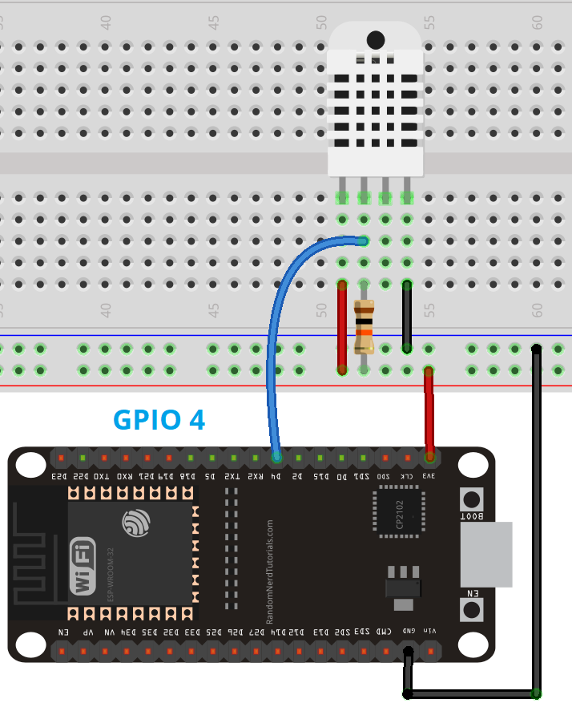

# sensor-stream-sensor-node

This project demonstrates reading temperature and humidity from a **DHT22 (AM2302)** sensor using the **ESP32-C6-Zero** board and send data to web server.

---

## 📦 Components

- ESP32-C6-Zero
- DHT22 (AM2302)
- 4.7-10 kΩ resistor (for pull-up on DATA)
- Jumper wires or breadboard

---

## 🔌 Wiring


- 3.3V --> VCC DHT22
- GND --> GND DHT22
- GPIO4 --> DATA DHT22 (through 4.7-10kΩ resistor to 3.3V)

## 📚 Libraries Used

- [DHT sensor library by Adafruit](https://github.com/adafruit/DHT-sensor-library)
- [Adafruit Unified Sensor](https://github.com/adafruit/Adafruit_Sensor)
- WiFi.h (built-in)
- HTTPClient.h (built-in)
- time.h (built-in)

> Install via **Arduino IDE → Tools → Manage Libraries…** if missing.

## ⚡ Features

- Reads temperature and humidity from DHT22 sensor.
- Sends JSON payload to server **POST /api/v1/measurements**:
    ```json
    {
      "temperature": 23.5,
      "humidity": 60,
       "timestamp": "2025-11-11T15:45:00Z"
    }
    ```
- Easy to extend for multiple ESP32 sensors.

### 🔧 Setup

1. Встановлення залежностей через Homebrew
   Відкрийте термінал і встановіть необхідні системні пакети:
   ```
   brew install cmake ninja dfu-util python3
   ``` 
2. Завантаження ESP-IDF SDK
    ```
    mkdir -p ~/esp
    cd ~/esp
    git clone -b v5.3 --recursive https://github.com/espressif/esp-idf.git
    ```

3. Інсталяція інструментів
   Запустіть скрипт інсталяції, який завантажить необхідні тулчейни:
   ```
    cd ~/esp/esp-idf
   ./install.sh esp32c6
   ```

4. Налаштування змінних оточення (export)
   Щоб команда `idf.py` стала доступною в терміналі, потрібно виконати:

    ```
    ~/esp/esp-idf/export.sh
    ```
    Порада: Щоб не вводити це кожного разу, додайте аліас у свій ~/.zshrc:

    ```
    echo 'alias get_idf=". $HOME/esp/esp-idf/export.sh"' >> ~/.zshrc
    source ~/.zshrc
    ```
    Тепер ви зможете просто написати get_idf у новому терміналі, і все налаштується автоматично.

1. Copy secrets.template.h to `secrets.h` and fill in your credentials:
2. Install the required libraries via Arduino IDE.
3. Upload the sketch to your ESP32-C6-Zero.

### ⚡ Notes

- Ensure the pull-up resistor is installed between DATA and VCC; otherwise, readings may fail.
- If nothing appears in the Serial Monitor:
  - Check the correct COM port
  - Select board: ESP32C6 Dev Module
  - Press RST on the board
  - Ensure baud rate = 115200
  - Ensure "USB CDC On Boot" is set to 'Enabled' in Arduino IDE
