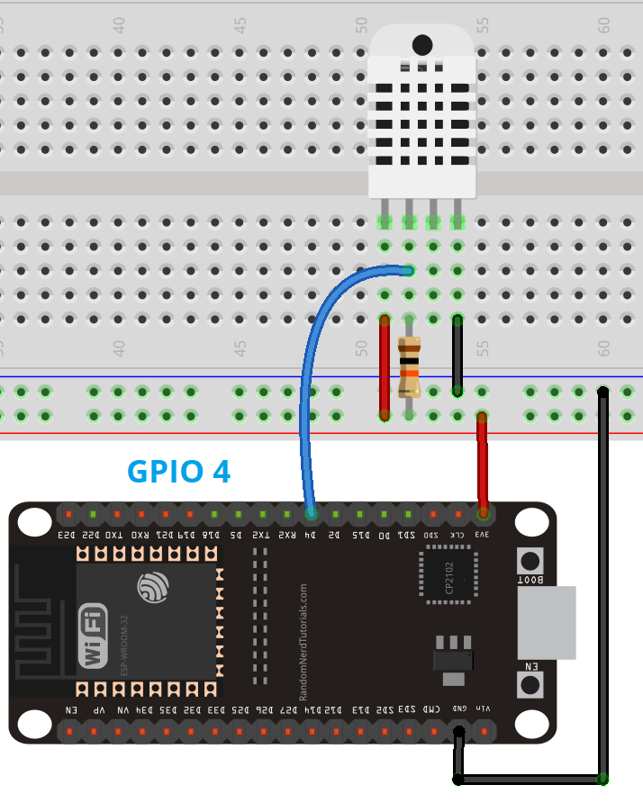

# sensor-stream-sensor-node

This project demonstrates reading temperature and humidity from a **DHT22 (AM2302)** sensor using the **ESP32-C6-Zero** board and send data to web server.

---

## 📦 Components

- ESP32-C6-Zero
- DHT22 (AM2302)
- 4.7-10 kΩ resistor (for pull-up on DATA)
- Jumper wires or breadboard

---

## 🔌 Wiring


- 3.3V --> VCC DHT22
- GND --> GND DHT22
- GPIO4 --> DATA DHT22 (through 4.7-10kΩ resistor to 3.3V)
- 3.3V --> VCC OLED
- GND --> GND OLED
- GPIO21 --> SCL OLED
- GPIO22 --> SDA OLED

## ⚡ Features

- Reads temperature and humidity from DHT22 sensor.
- Sends JSON payload to server **POST /api/v1/measurements**:
    ```json
    {
      "temperature": 23.5,
      "humidity": 60,
       "timestamp": "2025-11-11T15:45:00Z"
    }
    ```
- Easy to extend for multiple ESP32 sensors.

## 🔮 Future features

### Battery monitoring with the current ESP32-C6-Zero and TP4056

The TP4056 does not report which source is powering the ESP32 and does not
provide a battery percentage. With the current modules and two resistor
dividers, firmware could:

- Detect whether USB voltage is present at the TP4056 input. This reports USB
  presence at the charger, **not** which source actually powers the ESP32.
- Estimate battery voltage and show a rough charge level. This is an estimate,
  not a fuel-gauge reading; voltage varies with load and while charging.

Possible measurement wiring, subject to confirming the exact board pinout:

```text
Battery voltage: TP4056 B+ -- 100 kOhm --+-- ESP32-C6-Zero GPIO5 (ADC)
                                          +-- 100 kOhm -- common GND / B-

USB presence:    TP4056 IN+ -- 100 kOhm --+-- ESP32-C6-Zero GPIO3 (ADC)
                                          +-- 100 kOhm -- common GND / IN-
```

The resistor midpoint halves the input voltage: up to 4.2 V from a single-cell
Li-ion battery becomes about 2.1 V at the ADC; 5 V USB becomes about 2.5 V.
Connect TP4056 and ESP32 grounds together. Never connect battery or USB voltage
directly to an ESP32 GPIO. Configure and calibrate the ESP-IDF ADC, convert the
measured divider voltage back to the source voltage in firmware, and validate
the readings with a multimeter before relying on them. Confirm GPIO3 and GPIO5
are exposed and available on the exact board revision before wiring.

This arrangement can report **USB present** and approximate **battery voltage**,
but cannot reliably determine whether USB or the battery is actually supplying
the ESP32. The TP4056 is a charger, not a power-path/UPS controller. Its `OUT`
voltage follows the battery (roughly 3.0–4.2 V), so do not connect `OUT+`
directly to the ESP32 `5V` pin. A safe battery-powered setup needs a suitable
regulated supply; seamless source detection/switching needs a power-path/UPS
module with a status output. TP4056 charge-status LEDs indicate charging state,
not the ESP32's power source.

### 🔧 Setup

Install the PlatformIO IDE extension in VS Code and open the `node` directory.
Run **PlatformIO: Build** for the `esp32-c6` environment. PlatformIO installs the
pinned Espressif32 7.1.3 platform (ESP-IDF 6.1) and managed `cjson` component
automatically; no separate ESP-IDF installation or Arduino libraries are needed.

The project uses `sdkconfig.defaults` and `partitions.csv` for its 8 MB flash
configuration and a 2 MB application partition. Before flashing, configure
`main/secrets.h` from `main/secrets.template.h`.

The 128x64 SSD1306 OLED is connected over I2C at address `0x3C`. The firmware
shows the latest temperature and humidity; sensor read failures appear as
`DHT ERROR`. If the display does not respond, check its I2C address and wiring.

For this personal project, TLS server-certificate verification is disabled so
the node can connect even if its CA bundle or clock is not set up. HTTPS traffic
remains encrypted, but the node cannot verify the server's identity and is
vulnerable to man-in-the-middle attacks. Do not use this setting for sensitive
data or production deployments.

### Build, flash, and monitor

- Build with **PlatformIO: Build**.
- Connect the board and flash with **PlatformIO: Upload**. Select the correct
  serial port if PlatformIO does not detect it automatically.
- Open **PlatformIO: Monitor** at 115200 baud. Press `Ctrl+]` to exit.

### ⚡ Notes

- Ensure the pull-up resistor is installed between DATA and VCC; otherwise, readings may fail.
- If nothing appears in the Serial Monitor:
  - Check the correct COM port
  - Press RST on the board
  - Ensure baud rate = 115200
